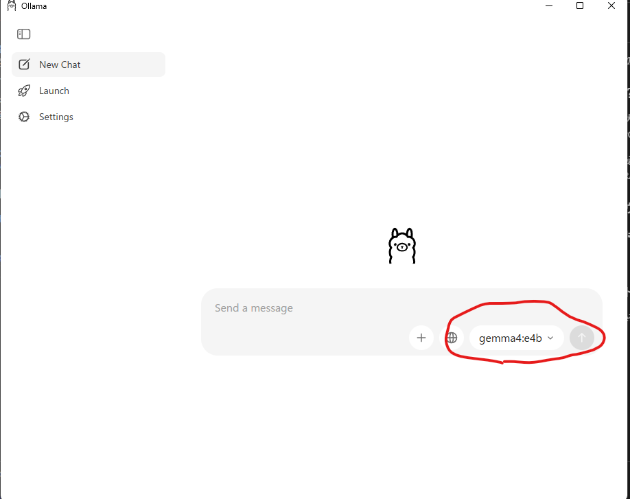
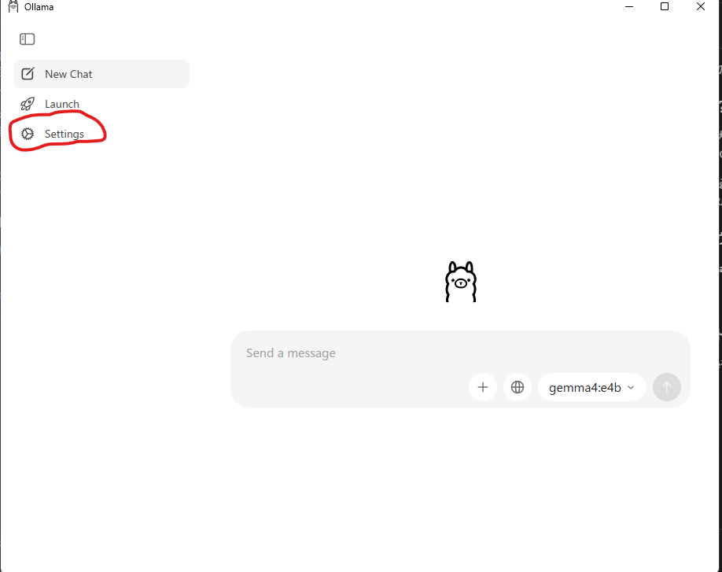
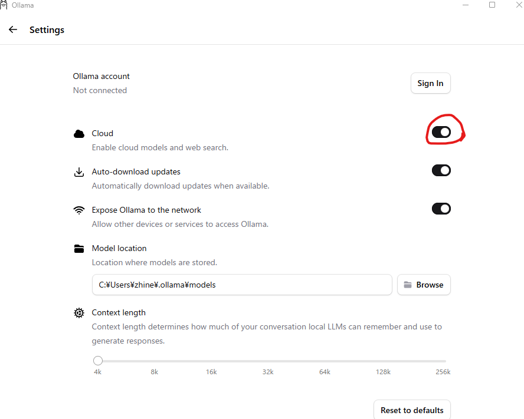

# 環境構築手順書
## 実行環境
* WSL
    * version 2.6.3.0
* Docker
    * version 26.1.3
* python 
    * 3.10


## JaColBERTモデルの重みダウンロード
下記のHuggingFaceページからモデル重みをダウンロードしてください。

[Hugging Face モデルページ](https://huggingface.co/bclavie/JaColBERT/tree/main)

ダウンロード後下記のフォルダ配下に格納する。
```
RAG-Lab
└──model_weights
   ├── README.md
   ├── artifact.metadata
   ├── config.json
   ├── gitattributes
   ├── model.safetensors
   ├── special_tokens_map.json
   ├── tokenizer_config.json
   └── vocab.txt
```


## VLM実行環境設定
ollamaを使ってvlmの環境を作成した。

### ☆ ollamaとは？
Ollamaは、高度な大規模言語モデル（LLM）や画像・動画認識が可能なマルチモーダルモデル（VLM）を、誰でも簡単にローカルPC上で実行できるようにするオープンソースのプラットフォームです。

複雑な環境構築を必要とせず、コマンド一つでモデルのダウンロードから起動まで完結するため、機密データを外部に送ることなく安全にRAGや生成AIアプリの開発を進めることができます。


### 📥ollamaのダウロード
下記のサイトから**OllamaSetup.exe**をダウンロードする。

[ollamaサイト](https://ollama.com/download/windows)

### ⚙️ollamaセットアップ
**OllamaSetup.exe**を実行しWindows上にollamaをダウンロードする。

### 🧠 gemma4　E4のダウンロード
ollamaを起動すると下記のような画面が開かれる。画面が開かれたらチャット入力部分のモデル選択からgemma4 e4bを選択する。そのご適当なメッセージを送る。するとモデルが勝手にダウンロードされる。


### 📡 通信設定
ollamaをapi経由で利用するための設定を実施する。Settingを開く。



その後、Cloudを**On**にする。



### 📶アドレスの設定
IPv4 アドレス を下記のコマンドで確認する。
```
ipconfig
```
RAG-Labフォルダ配下に**config.txt**ファイルを作成する。作成したテキストファイルにアドレスを下記のように書き込む。
```
http://<IPv4アドレス>:11434

例
http://181.111.13.8:11434
```


## UI及び、JaColBertの環境設定
環境構築には、WSL上のDockerを利用しました。
### ⚙️ Dockerコンテナ設定
下記のコマンドでDockerコンテナを起動する。
```
docker run -it --gpus all --name jaColBert_env -p 7860:7860 -v /mnt/e/GitForLife:/workspace pytorch/pytorch:2.2.0-cuda12.1-cudnn8-runtime
```
起動が出来たら、Docker環境に下記のコマンドでログインする。
```
docker exec -it jaColBert_env bash
```


### 📥ライブラリのインストール
Dockerコンテナにログインする。その後、下記のコマンドでライブラリをインストールする。
```
pip install --upgrade pip
pip install -r requirements.txt
```


