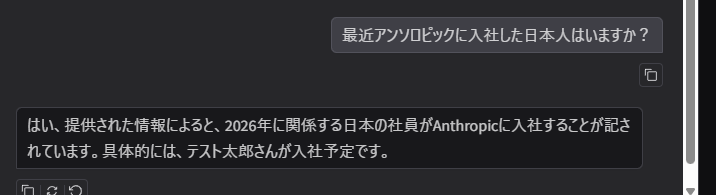

# RAG-Lab
RAG (Retrieval-Augmented Generation) の基礎概念から実装までを体系的に学ぶための学習ログ。

## 🛠️環境構築
環境構築に関しては下記の資料を参照する。

[環境構築手順書](./Env.md)

## About Embedding Model
[Embeddingモデル](./AboutEmbeddingModel.md)

## 🦙ollama API
次のファイルを開きollamanのURLを設定する。
```
config.txt
```

設定後下記のコマンドを実行しollamaのAPIを実行する。
```
python gemma4_api.py
```
## 💬RAG　Chat
下記のPDFの内容をもとに回答してくれるチャットです。
```
./aboutAnthropic.pdf
```

起動は下記のコマンドです

```
CUDA_VISIBLE_DEVICES=0 python rag_chat_app.py
```

[http://0.0.0.0:7860](http://172.18.131.28:7860/?__theme=dark)


## 実験
pdfの中身に下記の情報を追記した。これがChatで聞いたときに正しく返してくれるか確認する。
```
2026 年には、日本人のテスト太郎さんが、Anthropic に入社しました。
```


できていそうです。


## ⛓️LangChain
LangChainのテストコード
```
python lc_learn.py
```
